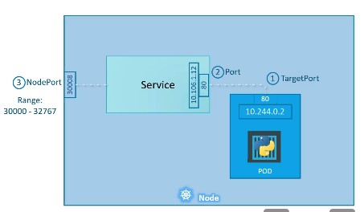

# Kubernetes 

Basic skeleton structure of any YAML file in K8s:
```YAML
apiVersion:
kind:
metadata:

spec:

```

| Kind        | Version |
|------------ | ---------
| pod         | v1      |
| Service     | v1      |
| ReplicaSet  | apps/v1 |
| Deployment  | apps/v1 |

<br>

---
<br>

## Pod

### pod-definition.yml

```yaml
apiVersion: v1
kind: Pod
metadata: 
    name: myApp-pod
    # Labels are tags to identify the pod
    labels:  
        app: myApp
        type: frontend
spec:
    containers:
        - name: nginx-container
          image: nginx           
        - name: busybox-container
          image: busybox
```

- Create a pod:  
`kubectl create -f pod-definition.yml / kubectl apply -f pod-definition.yml`

- Get list of pods:  
`kubectl get pods`

- Get pod Details:  
`kubectl describe pod <pod_name>`

- Delete a pod:  
`kubectl delete pod <pod_name>`

<br>

---

<br>

## Replication Controller 

Used for running multiple pods in the cluster to maintain high availability.

For single pods, it helps in bringing back the pod in case it goes down/crashes for some reason.

ReplicaSet is similar to replication controller and the newer implementation of replication controller.

### rc-definition.yml 
```YAML
apiVersion: v1
kind: ReplicationController
metadata:
    name: myApp-rc
    labels:
        app: myApp 
        type: frontend
spec:
    replicas: 3
    # Template to be used to spin up pods
    template:
        metadata: 
                name: myApp-pod    
                labels:  
                    app: myApp
                    type: frontend
                spec:
                    containers:
                    - name: nginx-container
                      image: nginx           
                    - name: busybox-container
                      image: busybox    
```

- Create replica controller:   
`kubectl create -f rc-definition.yml`

- Get list of replica controllers:  
`kubectl get replicationcontroller`

<br>

## Replica Set

Similar to replication controller, ApiVersion is different to `apps/v1`.

Also, needs a selector tag to ensure which pods are maintained by it. This is because Replica set can also manage pods that were not created by it. 

Selector is avalable in Replication Controller but it's not as varied as replica set and not mandatory either.

### replicaset-definition.yml
```YAML
apiVersion: apps/v1
kind: ReplicaSet
metadata:
    name: myApp-replicaSet
    labels:
        app: myApp 
        type: frontend
spec:
    replicas: 3
    selector: 
        matchLabels:
            type: frontend
    # Template to be used to spin up pods
    template:
        metadata: 
                name: myApp-pod    
                labels:  
                    app: myApp
                    type: frontend
                spec:
                    containers:
                    - name: nginx-container
                      image: nginx           
                    - name: busybox-container
                      image: busybox   
```

- Create replica set:   
`kubectl create -f replicaset-definition.yml`

- Get list of replica controllers:  
`kubectl get replicaset`

- Delete replica set:  
`kubectl delete replicaset myApp-replicaSet`

<br>

## Scaling

To change the number of pods, i.e., to scale when the pods are already running:

- Update the value of replicas in the original file and re-apply using replace command   
`kubectl replace -f replica-definition.yml`

- Run the scale command with the new number of replicas along with the filename or replicaset name. The original file won't be updated.  
`kubectl scale --replicas=6 -f replicaset-definition.yml`  
`kubectl scale --replicas=6 replicaset myApp-replicaSet`  
Syntax: `kubectl scale --replicas=<number> <type> <replica_set_name>`                            

<br>

---

<br>

## Deployments 

Pods -> Replica Set -> Deployment

### deployment-definition.yml
```YAML
apiVersion: apps/v1
kind: Deployment
metadata: 
    name: myApp-deployment
    labels: 
        app: myApp
        type: frontend
spec:
    replicas: 3
    selector:
        matchLabels:
            type: frontend
    template:
        metadata: 
            name: myApp-pod    
            labels:  
                app: myApp
                type: frontend
        spec:
            containers:
            - name: nginx-container
              image: nginx           
            - name: busybox-container
              image: busybox  
```

- Create a deployment:  
`deployment create -f deployment-definition.yml`  
`deployment apply -f deployment-definition.yml`

- List all deployments:  
`kubectl get deployments`

- Get deployment details:  
`kubectl describe deployment <deployment_name>`

- Get all details of all objects:  
`kubectl get all`

- Edit the deployment while it's running:  
`kubectl edit deployment <deployment_name>`

- Change image of the container while a deployent is running:  
`kubectl set image deployment <deployment_name> <container_name>=<image_name:tag>`  
Eg. - `kubectl set image deployment myApp-deployment nginx-container=nginx:1.18-perl`

<br>

### Deployment Strategies

- <b>Recreate</b>  
When a new version is being deployed, all the old pods are destroyed first and then new pods with the updated config are spun up.  
There will be a downtime associated with this strategy and this is not the default strategy.

- <b>Rolling Update</b>  
The default deployment strategy. It pulls down one old pod and spins up the updated pod replacing it and only then moves on to follow the same process for the other pods, one at a time.  
It also replaces the replica set.

<br>

### Rollout & Versioning
When a deployment is created, a new rollout is triggered and a new revision is created, say Revision_1. When the next deployment happens, Revision_2 is created. This helps to track the changes in deployments and help to rollback easily in case things go wrong.

- Check status of rollout:  
`kubectl rollout status deployment/myApp-deployment`

- Get history of rollouts:  
`kubectl rollout history deployment/myApp-deployment`

- Undo/Revert a rollout:  
`kubectl rollout undo deployment/myApp-deployment`

<br>

---  

<br> 

## Networking

- Pod hosts a container. The IP address is always assigned to the pod unlike in Docker where it is assigned to a container.

- Kubernetes creates a private network 10.244.0.0 inside the node and assigns the IPs to the pods.

- The IPs of the pods may change when they are recreated and hence it's not a good idea to access them using the private IPs.
- For a cluster, Kubernetes does not create any kind of network but expectes us to set up a network which fulfils the following criteria:
    - All containers/pods are able to communicate with one another without NAT.
    - All nodes can commuicate with all containers and vice-versa wthout NAT.
- Using networking solutions like Flannel, Cilium, NSX for VMware, Weaveware (used by K8s labs) fulfils the above criteria assigining different IPs to every node & pod and enabling communication between all through simple routing.

<br>

---

<br>

## Services

Kubernetes Services enables communcation between various componenents whithin and outisde the application. Helps in connecting applications together with other applications or users.

It is an object like pods or replicasets situated in a node.

### Nodeport
Nodeport is one of the use cases of Kubernetes service. It listens to requests on a port of the node and forward requests to the pod on a port.  
- The IP of the Service is known as the cluster IP of the Service.
- The port on the pod from which the requests are actually served is the Target Port.
- The port of the node over which the request is sent to the service is the NodePort.   
The range of NodePort is 30000 - 32767.
- It acts as a load balancer when multiple replica pods are present balancing out the load by redirecting traffic to the pods chosen randomly.
- In case of same pod being present in multiple nodes, the service spans cross all nodes and the same NodePort is made available. We need to choose the Node IP and keep the same NodePort to access our application pod in different nodes.

<br>



<br>
<br>

<b>service-definition.yml</b>
```YAML
apiVersion:v1
kind: Service
metadata: 
    name: myApp-service
spec:
    type: NodePort
    ports:
    - targetPort: 80
      port: 80 
      nodePort: 30008
    # Labels of the pods for which the service is created
    selector:   
        app: myApp
        type: frontend 
```

- `port` is mandatory
- `targetPort` will be same as port if not specified.
- `nodePort` will be randomly assigned from the specified range based on availability.

<br>

- Create the service:  
`kubectl create -f service-definition.yml`

- List all services:  
`kubectl get services` / `kubectl get svc`

<br>

### Cluster IP
It creates a virtual IP to enable communication between various services like set of frontend servers to set of backend servers.
It serves as a load balancer taking in the requests for the cluster and redirecting it to the pods chosen randomly.

<br>

<b>service-definition.yml</b>
```YAML
apiVersion: v1
kind: Service
metadata:
    name: backend
spec:
    type: CLusterIP         # Cluster IP is taken by default for Service
    ports:
        - targetPort: 80    # where backend is exposed (port forwarded to)
          port: 80          # where service is exposed (port to be acessed with ClusterIP)
    # Labels of the pods for which the ClusterIP is applicable.
    selector:
        app: myApp
        type: frontend 
```
 <br>

### Load Balancers

Could only be used in supported platforms like GCP, AWS & Azure.
It serves as the entrypoint of the application for the frontend and drives traffic to different clusters randomly.

<b>service-definition.yml</b>
```YAML
apiVersion: v1
kind: Service
metadata: 
    name: myApp-service
spec: 
    type: LoadBalancer
    ports: 
        - targetPort: 80
          port: 80
          nodePort: 30008
```